Author, Taha Khan.

Date, 14 May 2026.

Version, 1.0.

Status, draft for review.

# Document control

| Version | Date | Author | Nature of change |
|---|---|---|---|
| 1.0 | 14 May 2026 | Taha Khan | Initial issue |

# Table of contents

Chapter 1. Introduction

1.1 Purpose

1.2 Scope

1.3 Definitions, acronyms, and abbreviations

1.4 References

1.5 Document conventions

1.6 Document overview

Chapter 2. Overall description

2.1 Product perspective

2.2 Product feature pillars

2.3 User classes and characteristics

2.4 Operating environment

2.5 Design and implementation constraints

2.6 Assumptions and dependencies

Chapter 3. System architecture

3.1 Architectural style

3.2 Component diagram

3.3 Backend layered architecture

3.4 Design patterns in use

3.5 Anti patterns explicitly disallowed

Chapter 4. User classes and use cases

4.1 Customer use cases

4.2 Organiser use cases

4.3 Administrator use cases

Chapter 5. Functional requirements

5.1 Authentication

5.2 Event management, organiser side

5.3 Event moderation, administrator side

5.4 Event discovery, customer side

5.5 Ticket booking

5.6 Waitlist management

5.7 Payments and refunds

5.8 Notifications

5.9 Business rules

Chapter 6. External interface requirements

6.1 User interfaces

6.2 Hardware interfaces

6.3 Software interfaces

6.4 Communication interfaces

Chapter 7. Data requirements

7.1 Conceptual data model

7.2 Entity relationship diagram

7.3 Data dictionary

7.4 Integrity rules

Chapter 8. State and behaviour models

8.1 Event lifecycle

8.2 Booking status

8.3 Waitlist entry status

8.4 Application fee status

8.5 Booking sequence

8.6 Waitlist promotion sequence

8.7 Event submission and approval sequence

8.8 Mass refund sequence

Chapter 9. Non functional requirements

9.1 Performance

9.2 Security

9.3 Reliability and data consistency

9.4 Maintainability

9.5 Usability

9.6 Portability

9.7 Auditability

Chapter 10. Agile delivery plan

Chapter 11. Traceability matrices

11.1 Use case to functional requirement

11.2 Functional requirement to screen

11.3 Functional requirement to phase

Chapter 12. Assumptions, constraints, and open questions

12.1 Assumptions

12.2 Constraints

12.3 Resolved ambiguities

12.4 Open questions deferred to later sprints

Chapter 13. Glossary

Appendix A. Source resource summary

Appendix B. Architecture decisions

Appendix C. Sample data payloads

Appendix D. Mermaid diagram sources

List of figures

Figure 1. System component overview

Figure 2. Backend layered architecture

Figure 3a. Customer use cases

Figure 3b. Organiser use cases

Figure 3c. Administrator use cases

Figure 4. Entity relationship diagram

Figure 5. Event lifecycle

Figure 6. Booking status

Figure 7. Waitlist entry status

Figure 8. Application fee status

Figure 9. Booking sequence

Figure 10. Waitlist promotion sequence

Figure 11. Event submission and approval sequence

Figure 12. Mass refund sequence

List of tables

Table 1. Scope summary

Table 2. Design patterns in use

Table 3. Screen catalogue

Table 4. Entity summary

Table 5. User fields

Table 6. Event fields

Table 7. Booking fields

Table 8. Ticket fields

Table 9. Payment fields

Table 10. WaitlistEntry fields

Table 11. Notification fields

Table 12. ApplicationFee fields

Table 13. Phase summary

Table 14. Functional requirement to phase mapping

Table 15. Use case to functional requirement matrix

Table 16. Functional requirement to screen matrix

Table 17. Functional requirement to phase matrix

# Chapter 1. Introduction

## 1.1 Purpose

This document specifies the software requirements for the Event and Ticket Management platform. It is written for the development team that will build the system, for the academic reviewer who will assess it, and for any future maintainer who will extend it. The purpose is to record, in a single reference, what the system shall do, how it shall behave, the data it shall hold, the interfaces it shall expose, and the constraints under which it shall operate.

## 1.2 Scope

The platform supports the full lifecycle of public events. Organisers submit events for review against a refundable application fee. A super administrator approves or rejects each submission. Customers browse approved events, filter by date, category, and location, book one or more tickets per event, and either receive a Quick Response (QR) coded ticket or join a waitlist when the event is full. The waitlist auto promotes the next person in line whenever a booking is cancelled. Payments and refunds are handled through Stripe. Confirmations and waitlist alerts are delivered by electronic mail.

The following table records the scope boundary.

Table 1. Scope summary.

| In scope (version one) | Out of scope (version one) |
|---|---|
| Event submission with refundable application fee | Multiple ticket tiers (early bird, VIP) |
| Administrator approval queue with reject reason | Bulk approval or rejection by the administrator |
| Customer browsing, filtering, and event details page | Full text search across the event catalogue |
| Ticket booking with concurrent slot safety | Seat selection (numbered seating) |
| Waitlist with fifteen minute timed hold on promotion | Notification channels other than email |
| QR coded ticket delivered by email | Mobile application clients |
| Stripe payments and refunds | Payment gateways other than Stripe |
| Organiser cancellation with mass refund | Event duplication (clone past event) |
| Organiser analytics on the events they own | Role based discount codes and coupons |

## 1.3 Definitions, acronyms, and abbreviations

Common terms used in the document.

| Term | Meaning |
|---|---|
| Application fee | A refundable fee paid by the organiser at the moment of event submission. Consumed by the platform on approval; refunded on rejection. |
| Booking | A customer purchase of one or more tickets for a single event. |
| Capacity | The total number of tickets that an event accepts. |
| Customer | An end user who browses events and books tickets. |
| Escrow | A holding state for funds; in this document, the Stripe authorisation used to hold the application fee until approval or rejection. |
| ERD | Entity Relationship Diagram. |
| Event | A scheduled occasion for which tickets are sold. |
| FR | Functional requirement. |
| JWT | JSON Web Token. |
| Mass refund | The automatic refund of every confirmed booking for an event when the event is cancelled. |
| MoSCoW | A priority scheme; Must, Should, Could, Won't. |
| NFR | Non functional requirement. |
| Organiser | A user who creates and manages events. |
| QR code | Quick Response code; a two dimensional barcode used to validate a ticket. |
| Refund window | The interval, set per event by the organiser, during which a customer may cancel a booking for a refund. |
| Remaining | The current count of unsold tickets for an event. |
| Super administrator | A privileged user who approves or rejects event submissions and moderates the platform. |
| UC | Use case. |
| Waitlist | The ordered queue of customers waiting for a ticket on a full event. |

## 1.4 References

Reference material consulted for this document.

1. Agile project proposal for the platform, available in the project resources folder.
2. Project flow analysis, available in the project resources folder.
3. Wireframe collection, available in the project resources folder as a draw.io diagram.
4. Work breakdown structure, available in the project resources folder as an image.
5. RFC 2119, Key words for use in Requests for Comment to Indicate Requirement Levels, S. Bradner, Internet Engineering Task Force, March 1997.
6. RFC 7807, Problem Details for HTTP APIs, M. Nottingham and E. Wilde, Internet Engineering Task Force, March 2016.
7. Stripe API reference, Stripe Inc., used for payment intent and refund integration.
8. PostgreSQL fifteen documentation, used for relational data types and concurrency primitives.

## 1.5 Document conventions

The document follows a small set of fixed conventions. Sentences use third person and present tense. The verbs shall, should, and may carry the meaning defined in RFC 2119. Identifiers for requirements, business rules, and use cases follow a three part pattern; the kind, the domain, and a three digit sequence number that is never reused. Cross references use the literal identifier; the prose does not point to section numbers. Figures and tables carry numeric captions placed immediately above the figure or table. Mermaid source listings act as placeholders for rendered images; the captions and numbering are stable across that swap.

## 1.6 Document overview

Chapter two places the system in context. Chapter three describes the architecture. Chapter four lists the use cases for each user role. Chapter five lists every functional requirement. Chapter six lists the external interfaces. Chapter seven describes the data model. Chapter eight collects the state machines and the sequence diagrams. Chapter nine lists the non functional requirements. Chapter ten records the agile delivery plan. Chapter eleven gives three traceability matrices. Chapter twelve records assumptions, constraints, and open questions. Chapter thirteen is the glossary. Four appendices follow.

# Chapter 2. Overall description

## 2.1 Product perspective

The platform is a standalone web based system. It is delivered as a single page application served alongside a representational state transfer (REST) application programming interface (API). It depends on three external services; Stripe for payments and refunds, a simple mail transfer protocol (SMTP) relay for email delivery, and a PostgreSQL relational database for storage. There is no other system that this product replaces. There is no parent product. The system is the whole of the user experience for every role.

## 2.2 Product feature pillars

The product is organised into eight feature pillars. Each pillar maps to one or more services on the server and to one or more screens in the client.

1. Authentication. Self serve registration and login for customers and organisers; administrator accounts are provisioned out of band. Sessions are carried by signed JSON web tokens.
2. Event submission and moderation. Organisers create event drafts; a refundable application fee is captured at submission; the administrator approves or rejects, and the fee is resolved accordingly.
3. Event discovery. Customers see a curated top events list on the home page, browse a paginated catalogue of all approved events, and filter by date, category, and location.
4. Ticket booking. Customers buy one or more tickets for an event, the seat count is decremented atomically, a payment is charged through Stripe, and a ticket bearing a QR code is delivered by email.
5. Waitlist management. When an event is full a customer may join the waitlist. On any cancellation the next entry is promoted into a fifteen minute held state and given a chance to convert.
6. Payments and refunds. Stripe is the payment gateway. Refunds run within a per event organiser set window. Cancellation of an event triggers a mass refund of every confirmed booking.
7. Notifications. Email is the only channel in this release. The system sends booking confirmations, waitlist alerts, event update notices, and refund confirmations.
8. Administration and analytics. Administrators work through a queue based dashboard. Organisers work through a dashboard that lists their events with simple analytics.

## 2.3 User classes and characteristics

The system has three user classes.

The customer is the most numerous class. A customer arrives on the home page, browses events, and books tickets. The customer is assumed to be a casual user, comfortable with the web but not a domain expert. The customer expects clear pricing, an obvious checkout flow, an email confirmation, and a visible QR coded ticket. The frequency of use is typically a handful of times per month.

The organiser is a less numerous but more engaged class. An organiser is assumed to be a small to medium business owner or an independent promoter who creates events on a regular cadence. The organiser is comfortable with online forms, file uploads, and online payments. The frequency of use ranges from weekly to daily during a launch.

The super administrator is a single class with a very small population, typically one to three users for the whole platform. The administrator is a platform operator who reviews submissions, decides on approval or rejection, and writes a short reason when rejecting. The administrator uses the system several times per day during peak intake.

## 2.4 Operating environment

The client is a modern web browser; the latest two major versions of Chrome, Edge, Firefox, and Safari are supported. The server runs on Node.js version twenty or later. The database is PostgreSQL version fifteen or later. The system is deployed as a set of containers orchestrated with Docker Compose for local development. Transport is over HTTP secured by transport layer security (TLS) in production.

## 2.5 Design and implementation constraints

The technology stack is fixed. The front end is React eighteen with Vite as the build tool. State is managed through React context and hooks; there is no global state container. The back end is Fastify on Node.js. The database is accessed exclusively through Sequelize models and migrations. The authentication scheme uses signed JSON web tokens.

The design discipline is also fixed. Conditional logic on the user role, on the payment gateway, on the notification channel, and on the event status is forbidden in the form of if and switch ladders. Each such concern is implemented as a strategy object or as a state object. Data access touches Sequelize models only inside the repository layer; no service or handler touches a model directly. Entity construction with defaults, identifier assignment, and QR code generation happens in factory functions; constructors and inheritance are not used.

## 2.6 Assumptions and dependencies

The platform assumes that Stripe is reachable from the server. The platform assumes that the outbound SMTP relay can deliver to the email addresses provided by users. The platform assumes that customers can render QR codes attached to email messages, either inline or as an attachment.

External dependencies that may change are tracked in chapter twelve as open questions or constraints.

# Chapter 3. System architecture

## 3.1 Architectural style

The system follows a classic three tier layered architecture. The presentation tier is a single page application rendered in the browser. The application tier is a Fastify server that exposes a REST API and orchestrates business logic through layered services. The data tier is a PostgreSQL database accessed through the Sequelize object relational mapper.

## 3.2 Component diagram

Figure 1. System component overview. The figure shows the actors, the front end application, the back end services, the database, and the three external systems.

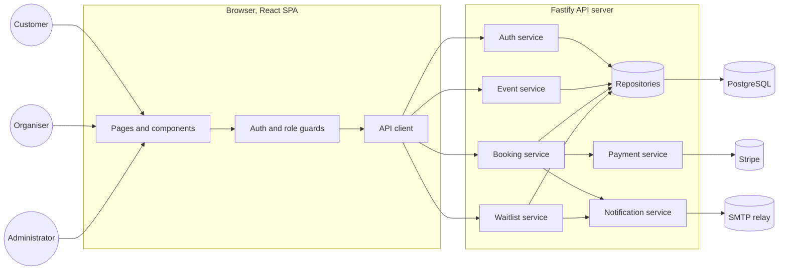

## 3.3 Backend layered architecture

Figure 2. Backend layered architecture. The figure shows the path of an incoming request through the layers and the cross cutting role of strategies and policies.

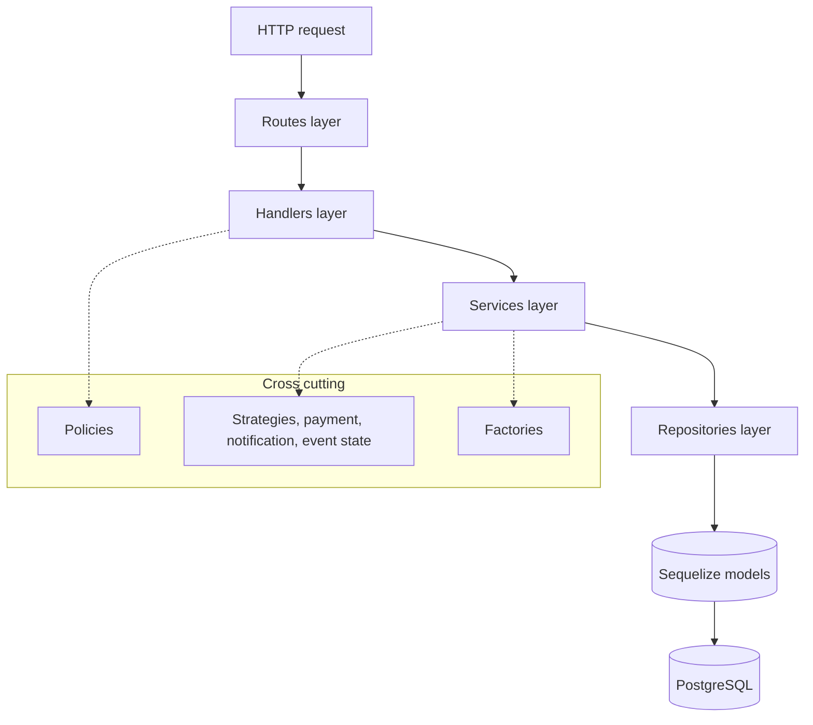

## 3.4 Design patterns in use

The following patterns are used. The choice is fixed and is not negotiable per feature.

Table 2. Design patterns in use.

| Concern | Pattern | Location | Rationale |
|---|---|---|---|
| Payment gateway | Strategy | strategies, payment | Allows a future gateway to be added without touching services |
| Notification channel | Strategy per channel | strategies, notification | Adding a new channel is a new file, not a service edit |
| Role based access | Policy objects via Strategy | strategies, policies | No conditional on user role appears in handler or service code |
| Event lifecycle | State pattern | strategies, event state | Each state owns its legal transitions; illegal transitions fail fast |
| Data access | Repository | repositories layer | Sequelize is contained; services are testable in isolation |
| Entity construction | Factory functions | strategies, factories | Defaults, identifiers, and QR generation are assembled once |
| Front end route protection | Guard components | guards folder | Declarative role gating on routes |

## 3.5 Anti patterns explicitly disallowed

The following code shapes are not permitted in the codebase.

1. Branching on the user role with if or switch statements outside the policy layer.
2. Branching on the event status with if or switch statements outside the event state layer.
3. Branching on the payment gateway identifier; the strategy is resolved from configuration.
4. Direct access to Sequelize models from a handler or a service; access goes through a repository.
5. Use of ECMAScript class declarations on the server; all server code uses factory functions and plain objects.

# Chapter 4. User classes and use cases

The chapter lists the use cases for each user role. Each use case is described in a fixed format; identifier, name, primary actor, preconditions, main flow, alternate flows, postconditions, and the functional requirements that realise the use case.

## 4.1 Customer use cases

Figure 3a. Customer use cases. The figure groups the ten customer use cases around the customer actor.

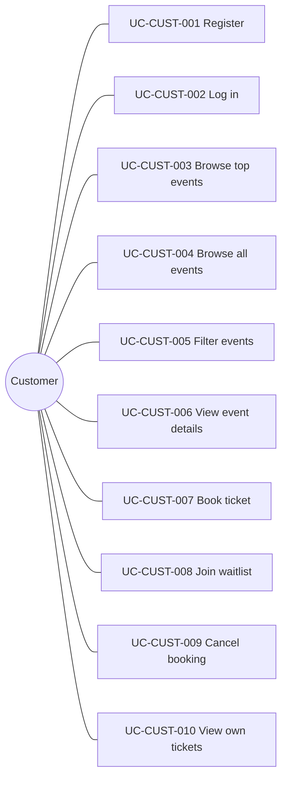

UC-CUST-001 Register.
Primary actor, prospective customer. Preconditions, the visitor is unauthenticated. Main flow, the visitor opens the register form, enters a name, an email address, and a password, and submits; the system creates a user with the customer role and returns a signed token. Alternate flow, the email address is already in use; the system returns a clear error and the form remains populated. Postcondition, the customer is authenticated. Realised by FR-AUTH-001 and FR-AUTH-003.

UC-CUST-002 Log in.
Primary actor, returning customer. Preconditions, the customer has an active account. Main flow, the customer opens the login form, enters credentials, and submits; the system verifies the password, signs a token, and returns it. Alternate flow, credentials are incorrect; the system returns a generic authentication error. Postcondition, the customer is authenticated. Realised by FR-AUTH-002 and FR-AUTH-003.

UC-CUST-003 Browse top events.
Primary actor, customer or anonymous visitor. Preconditions, none. Main flow, the visitor opens the home page; the system returns a curated list of top events. Postcondition, the top events list is displayed. Realised by FR-DISC-001.

UC-CUST-004 Browse all events.
Primary actor, customer or anonymous visitor. Preconditions, none. Main flow, the visitor navigates to the all events page; the system returns a paginated list of approved events. Postcondition, the catalogue is displayed. Realised by FR-DISC-002.

UC-CUST-005 Filter events.
Primary actor, customer or anonymous visitor. Preconditions, the catalogue is open. Main flow, the visitor selects filter values for date, category, or location, and applies; the system returns the filtered set. Postcondition, the filtered catalogue is displayed. Realised by FR-DISC-003.

UC-CUST-006 View event details.
Primary actor, customer or anonymous visitor. Preconditions, none. Main flow, the visitor opens an event details page; the system returns the event with the related events panel. Postcondition, the event detail is displayed. Realised by FR-DISC-004 and FR-DISC-005.

UC-CUST-007 Book ticket.
Primary actor, customer. Preconditions, the customer is authenticated, the event is in the active state, and the event has at least one remaining ticket. Main flow, the customer chooses a quantity, submits payment details, and confirms; the system creates a booking in the pending state, charges Stripe, decrements the remaining count atomically, transitions the booking to confirmed, issues a ticket per quantity unit with a QR code, and sends a confirmation email. Alternate flow, payment fails; the booking is cancelled and the remaining count is restored. Alternate flow, the remaining count is zero at the moment of decrement; the booking is cancelled and the customer is invited to join the waitlist. Postcondition, the customer holds one or more valid tickets and has received a confirmation email. Realised by FR-BOOK-001 through FR-BOOK-007.

UC-CUST-008 Join waitlist.
Primary actor, customer. Preconditions, the customer is authenticated and the event has zero remaining tickets. Main flow, the customer joins the waitlist; the system appends a waitlist entry to the queue and returns the position. Postcondition, the customer holds a waitlist position. Realised by FR-WAIT-001.

UC-CUST-009 Cancel booking.
Primary actor, customer. Preconditions, the customer holds a confirmed booking and the current time is before the refund deadline of the event. Main flow, the customer triggers cancel; the system refunds the booking through Stripe, transitions the booking to refunded, marks each ticket refunded, restores the remaining count, and triggers the waitlist promotion. Alternate flow, the refund deadline has passed; the cancel action is blocked at the user interface and the API. Postcondition, the customer is refunded and the freed seat is offered to the next waitlist entry. Realised by FR-BOOK-008, FR-PAY-006, and FR-WAIT-002.

UC-CUST-010 View own tickets.
Primary actor, customer. Preconditions, the customer is authenticated. Main flow, the customer opens the main dashboard; the system lists the customer's bookings and tickets with status, event summary, and QR. Postcondition, the customer can see the current state of their tickets. Realised by FR-BOOK-009.

## 4.2 Organiser use cases

Figure 3b. Organiser use cases. The figure groups the eight organiser use cases around the organiser actor.

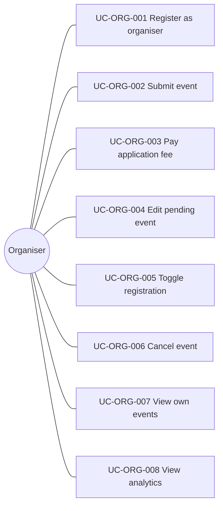

UC-ORG-001 Register as organiser.
Primary actor, prospective organiser. Preconditions, the visitor is unauthenticated. Main flow, the visitor opens the register form, selects the organiser role, enters details, and submits; the system creates the user with the organiser role. Postcondition, the organiser is authenticated. Realised by FR-AUTH-001 and FR-AUTH-003.

UC-ORG-002 Submit event.
Primary actor, organiser. Preconditions, the organiser is authenticated. Main flow, the organiser fills the event form (title, description, category, location, start and end date and time, capacity, ticket price, refund deadline, optional image) and submits; the system creates the event in the pending state and a paired application fee record in the held state. Postcondition, the event awaits administrator review. Realised by FR-EVT-001 and BR-FEE-001.

UC-ORG-003 Pay application fee.
Primary actor, organiser. Preconditions, an event in the pending state exists for the organiser and is paired with a held application fee. Main flow, the system charges the organiser through Stripe at submission time so the fee is captured before the administrator reviews. Postcondition, the application fee is held in escrow. Realised by FR-PAY-001 and BR-FEE-001.

UC-ORG-004 Edit pending event.
Primary actor, organiser. Preconditions, the event is in the pending state and is owned by the organiser. Main flow, the organiser edits fields and saves; the system applies the changes. Alternate flow, the event is already active; only a limited set of fields may be edited. Postcondition, the event reflects the new values. Realised by FR-EVT-002.

UC-ORG-005 Toggle registration.
Primary actor, organiser. Preconditions, the event is in the active state. Main flow, the organiser toggles the registration open flag; the system updates the flag and stops accepting new bookings while the flag is off. Postcondition, the toggle is applied. Realised by FR-EVT-003.

UC-ORG-006 Cancel event.
Primary actor, organiser. Preconditions, the event is in the active state. Main flow, the organiser cancels; the system transitions the event to the cancelled state, refunds every confirmed booking through Stripe, transitions every related booking and ticket to refunded, and notifies every affected customer. Postcondition, the event is cancelled and every customer has been refunded. Realised by FR-EVT-006, FR-PAY-007, and FR-NOTIF-003.

UC-ORG-007 View own events.
Primary actor, organiser. Preconditions, the organiser is authenticated. Main flow, the organiser opens the organiser dashboard; the system lists the events owned by the organiser. Postcondition, the list is displayed. Realised by FR-EVT-004.

UC-ORG-008 View analytics.
Primary actor, organiser. Preconditions, the event is owned by the organiser. Main flow, the organiser opens the track view; the system returns ticket sales count and revenue. Postcondition, the analytics view is displayed. Realised by FR-EVT-005.

## 4.3 Administrator use cases

Figure 3c. Administrator use cases. The figure groups the six administrator use cases around the administrator actor.

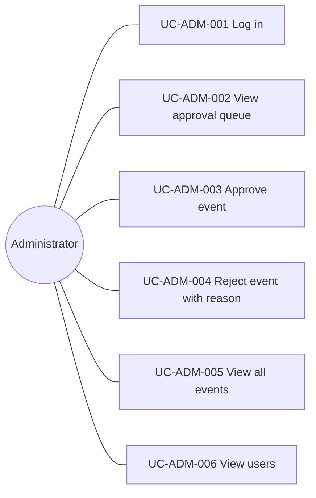

UC-ADM-001 Log in.
Primary actor, administrator. Preconditions, the administrator account exists. Main flow, the administrator submits credentials; the system returns a signed token bearing the administrator role. Postcondition, the administrator is authenticated. Realised by FR-AUTH-002.

UC-ADM-002 View approval queue.
Primary actor, administrator. Preconditions, the administrator is authenticated. Main flow, the administrator opens the approval page; the system returns every event currently in the pending state in submission order. Postcondition, the queue is displayed. Realised by FR-MOD-001.

UC-ADM-003 Approve event.
Primary actor, administrator. Preconditions, an event is in the pending state. Main flow, the administrator selects approve; the system transitions the event to the active state, captures the held application fee as platform revenue, and notifies the organiser. Postcondition, the event is approved and the fee is consumed. Realised by FR-MOD-002, FR-PAY-002, and FR-NOTIF-005.

UC-ADM-004 Reject event with reason.
Primary actor, administrator. Preconditions, an event is in the pending state. Main flow, the administrator selects reject, enters a short free text reason, and submits; the system records the reason on the event, refunds the application fee through Stripe, and notifies the organiser with the reason. Postcondition, the event remains pending with the rejection reason and the organiser is refunded. Realised by FR-MOD-003, FR-PAY-003, and FR-NOTIF-005.

UC-ADM-005 View all events.
Primary actor, administrator. Preconditions, the administrator is authenticated. Main flow, the administrator opens the administrator dashboard; the system returns every event filtered by status. Postcondition, the list is displayed. Realised by FR-MOD-004.

UC-ADM-006 View users.
Primary actor, administrator. Preconditions, the administrator is authenticated. Main flow, the administrator opens the users list; the system returns every user. Postcondition, the list is displayed. Realised by FR-MOD-005.

# Chapter 5. Functional requirements

Each requirement is recorded in a small block with five fields; identifier, statement, rationale, source, priority. Statements use shall, should, or may as defined in chapter one. Priorities follow the MoSCoW scheme. Acceptance criteria are written in measurable form alongside each statement.

## 5.1 Authentication

FR-AUTH-001 Self serve registration.
Statement, the system shall accept a registration request that carries a name, an email address, a password, and a role of customer or organiser. Rationale, customers and organisers are self serve users; only the administrator is provisioned out of band. Source, project flow analysis, authentication module. Priority, Must. Acceptance criterion, a successful registration returns a signed JSON web token in under one second and persists a user row with the chosen role; an attempt to reuse an email address fails with a clear conflict error.

FR-AUTH-002 Login.
Statement, the system shall verify credentials and return a signed JSON web token on success. Rationale, sessions are token bearing and stateless. Source, work breakdown structure, authentication module. Priority, Must. Acceptance criterion, an incorrect password fails with a generic authentication error and does not reveal whether the email exists.

FR-AUTH-003 Token bearing requests.
Statement, every protected endpoint shall require a valid JSON web token in the Authorization header; the system shall reject a request that lacks a token or carries an expired token. Rationale, the session is the token. Source, design constraints. Priority, Must. Acceptance criterion, a request without a token returns four hundred and one; a request with an expired token returns four hundred and one with a clear message.

FR-AUTH-004 Password hashing.
Statement, the system shall store passwords as bcrypt hashes with a cost factor of at least ten. Rationale, plaintext storage is unacceptable. Source, security baseline. Priority, Must. Acceptance criterion, no plaintext password is ever written to disk or to logs.

FR-AUTH-005 Role on the token.
Statement, the system shall include the user role as a claim on the JSON web token and shall use the claim to drive authorisation. Rationale, role lookup on every request is avoided. Source, design constraints. Priority, Must. Acceptance criterion, the authorisation policy reads the role from the token, not from the database.

## 5.2 Event management, organiser side

FR-EVT-001 Submit event.
Statement, an organiser shall create an event with the fields title, description, category, location, start date and time, end date and time, capacity, ticket price, refund deadline, and an optional image; on submission the event is created in the pending state and a paired application fee record is created in the held state. Rationale, every new event must pass administrator review and must pay the refundable application fee at the moment of submission. Source, project flow analysis. Priority, Must. Acceptance criterion, a submitted event appears in the administrator approval queue and a held application fee record exists for it.

FR-EVT-002 Edit event.
Statement, an organiser shall edit any field of an event that is still in the pending state, and shall edit only description, image, and refund deadline once the event is active. Rationale, after review the major facts are locked. Source, project flow analysis. Priority, Must. Acceptance criterion, an attempt to change the capacity or ticket price of an active event is rejected with a clear error.

FR-EVT-003 Toggle registration.
Statement, an organiser shall set a boolean registration open flag on an event in the active state; the system shall reject booking requests when the flag is off. Rationale, the organiser needs a manual stop without cancelling the event. Source, project flow analysis. Priority, Should. Acceptance criterion, with the flag off, a booking attempt returns four hundred and nine with a clear reason.

FR-EVT-004 List own events.
Statement, the system shall return every event owned by the requesting organiser, regardless of status. Rationale, the organiser dashboard lists every event. Source, work breakdown structure. Priority, Must. Acceptance criterion, the returned list contains exactly the events whose organiser identifier matches the caller.

FR-EVT-005 View event analytics.
Statement, the system shall return the count of confirmed bookings, the total revenue, and the count of remaining tickets for an event owned by the caller. Rationale, the organiser tracks sales. Source, work breakdown structure, organiser dashboard. Priority, Should. Acceptance criterion, the numbers reconcile with the sum of confirmed bookings and the ticket price of the event.

FR-EVT-006 Cancel event.
Statement, an organiser shall cancel an event in the active state; the system shall transition the event to the cancelled state, refund every confirmed booking, transition every related booking and ticket to refunded, and dispatch a notification to every affected customer. Rationale, an organiser may cancel for legitimate reasons; the platform must clean up. Source, agile project proposal. Priority, Must. Acceptance criterion, after cancellation no booking remains in the confirmed state and every customer has a refund confirmation email queued.

FR-EVT-007 Event status read.
Statement, every event read shall include the status field with a value of pending, active, cancelled, or completed. Rationale, the client renders different controls per state. Source, design constraints. Priority, Must. Acceptance criterion, the status field is present on every event response.

FR-EVT-008 Completed transition.
Statement, the system shall transition an active event to completed when the end date and time has passed. Rationale, completed events are no longer bookable and are excluded from the public catalogue. Source, agile project proposal. Priority, Should. Acceptance criterion, an event whose end has passed by more than five minutes is in the completed state.

## 5.3 Event moderation, administrator side

FR-MOD-001 List pending events.
Statement, the system shall return every event in the pending state in submission order to an administrator. Rationale, the approval queue is the administrator's primary work surface. Source, project flow analysis. Priority, Must. Acceptance criterion, the list is sorted by submission time, oldest first.

FR-MOD-002 Approve event.
Statement, an administrator shall approve a pending event; the system shall transition the event to active, capture the held application fee as platform revenue, and notify the organiser. Rationale, an approval ends the review cycle. Source, agile project proposal. Priority, Must. Acceptance criterion, after approval the event is active, the application fee is in the consumed state, and the organiser has an approval email queued.

FR-MOD-003 Reject event with reason.
Statement, an administrator shall reject a pending event with a short free text reason; the system shall keep the event in the pending state, record the reason, refund the held application fee, and notify the organiser with the reason. Rationale, rejection is a refundable outcome with a written justification. Source, agile project proposal. Priority, Must. Acceptance criterion, after rejection the application fee is in the refunded state and the organiser has the reason in the notification.

FR-MOD-004 List events by status.
Statement, the system shall return every event filtered by a status parameter to an administrator. Rationale, the administrator dashboard groups events by status. Source, work breakdown structure. Priority, Must. Acceptance criterion, the response contains only events whose status matches the parameter.

FR-MOD-005 List users.
Statement, the system shall return every user with role and creation date to an administrator. Rationale, the administrator manages users. Source, work breakdown structure. Priority, Should. Acceptance criterion, the response contains every user row with the required fields.

## 5.4 Event discovery, customer side

FR-DISC-001 Top events.
Statement, the system shall return a curated list of top events for the home page. Rationale, the home page surfaces appealing events. Source, project flow analysis. Priority, Must. Acceptance criterion, the response contains only events in the active state.

FR-DISC-002 Paginated catalogue.
Statement, the system shall return every active event with pagination through a page and limit parameter. Rationale, the catalogue is long. Source, project flow analysis. Priority, Must. Acceptance criterion, the response carries a page indicator and a total count.

FR-DISC-003 Filter by date, category, location.
Statement, the system shall accept any combination of date range, category, and location as filter parameters on the catalogue endpoint. Rationale, customers narrow their browsing. Source, project flow analysis, work breakdown structure. Priority, Must. Acceptance criterion, a date filter returns only events whose start date falls within the range.

FR-DISC-004 Event details.
Statement, the system shall return the full record of an event by identifier, including organiser name and remaining count. Rationale, the details page needs the full record. Source, project flow analysis. Priority, Must. Acceptance criterion, the response contains the full set of fields documented in chapter seven.

FR-DISC-005 Related events.
Statement, the system shall return up to five related events for a given event, selected by same category and proximity in date. Rationale, related items keep the customer engaged. Source, project flow analysis. Priority, Should. Acceptance criterion, the related set excludes the source event and contains only active events.

FR-DISC-006 Public read.
Statement, the discovery endpoints in this section shall be reachable without authentication. Rationale, the home page and the catalogue are public. Source, wireframe analysis. Priority, Must. Acceptance criterion, the discovery endpoints respond to requests that carry no token.

## 5.5 Ticket booking

FR-BOOK-001 Create booking.
Statement, a customer shall create a booking with a quantity of one or more tickets for an event in the active state with the registration flag on. Rationale, the booking is the unit of purchase. Source, project flow analysis. Priority, Must. Acceptance criterion, the created booking is in the pending state with the quantity and total amount populated.

FR-BOOK-002 Atomic seat decrement.
Statement, the system shall decrement the remaining count by the booking quantity inside a single database transaction with row level locking on the event. Rationale, two simultaneous bookings must not double sell the last seat. Source, agile project proposal, data consistency. Priority, Must. Acceptance criterion, under a load of one hundred concurrent booking attempts for one remaining seat, exactly one booking succeeds and the rest are cleanly rejected.

FR-BOOK-003 Charge payment.
Statement, the system shall create a Stripe payment intent for the total amount and confirm it before transitioning the booking to confirmed. Rationale, no booking is confirmed until the customer has paid. Source, agile project proposal. Priority, Must. Acceptance criterion, a payment intent identifier is recorded on the payment row.

FR-BOOK-004 Issue tickets.
Statement, the system shall create one ticket per quantity unit when the booking is confirmed and shall assign a unique QR code value to each ticket. Rationale, each ticket is a separate admission. Source, project flow analysis. Priority, Must. Acceptance criterion, a booking of quantity three produces three ticket rows with three distinct QR values.

FR-BOOK-005 Send confirmation email.
Statement, the system shall send a confirmation email with the ticket details and the QR codes once the booking is confirmed. Rationale, the customer carries the email to the event. Source, project flow analysis. Priority, Must. Acceptance criterion, a confirmation message is queued within ten seconds of the booking moving to confirmed.

FR-BOOK-006 Reject when full.
Statement, the system shall reject a booking when the remaining count is below the requested quantity and shall invite the customer to join the waitlist instead. Rationale, the waitlist is the fallback. Source, project flow analysis. Priority, Must. Acceptance criterion, a booking on a full event returns four hundred and nine with a waitlist hint.

FR-BOOK-007 Reject when closed.
Statement, the system shall reject a booking when the registration flag on the event is off. Rationale, organisers may suspend sales. Source, project flow analysis. Priority, Must. Acceptance criterion, a booking attempt while the flag is off returns four hundred and nine.

FR-BOOK-008 Cancel booking.
Statement, a customer shall cancel a confirmed booking while the current time is before the refund deadline of the event; the system shall refund the payment, transition the booking to refunded, mark each ticket refunded, restore the remaining count, and trigger waitlist promotion. Rationale, customers should be free to change plans within the refund window. Source, agile project proposal, refund policy. Priority, Must. Acceptance criterion, after cancellation the refund is recorded against the payment and the remaining count is increased by the booking quantity.

FR-BOOK-009 List own bookings.
Statement, the system shall return every booking placed by the requesting customer with a slim view of the related event. Rationale, the customer dashboard lists tickets. Source, project flow analysis. Priority, Must. Acceptance criterion, the list contains the booking, the ticket statuses, and a slim event payload with the title, date, and location.

FR-BOOK-010 No negative remaining.
Statement, the system shall never allow the remaining count to fall below zero. Rationale, the invariant is critical to integrity. Source, agile project proposal. Priority, Must. Acceptance criterion, the database column is constrained by a check that rejects negative values.

## 5.6 Waitlist management

FR-WAIT-001 Join waitlist.
Statement, a customer shall join the waitlist for an event in the active state when the remaining count is zero; the system shall append a waitlist entry with the next position and the queued status. Rationale, the waitlist captures interest beyond capacity. Source, agile project proposal. Priority, Must. Acceptance criterion, the response contains the position number and the entry exists with the queued status.

FR-WAIT-002 Auto promote on cancellation.
Statement, on every booking cancellation the system shall promote the next queued waitlist entry to the held state, set a hold expiry of fifteen minutes from the current time, and send a notification with a claim link. Rationale, freed seats should be filled in order. Source, agile project proposal. Priority, Must. Acceptance criterion, the next queued entry transitions to held within five seconds of the cancellation event.

FR-WAIT-003 Convert hold to booking.
Statement, a customer with a held waitlist entry shall book within the hold window; on booking the entry transitions to converted. Rationale, the hold is the customer's window to confirm. Source, agile project proposal. Priority, Must. Acceptance criterion, a successful booking sets the entry status to converted.

FR-WAIT-004 Expire stale hold.
Statement, the system shall transition a held waitlist entry to expired when the hold expiry passes without a booking, and shall promote the next queued entry. Rationale, no seat should sit idle. Source, agile project proposal. Priority, Must. Acceptance criterion, an entry whose hold expiry has passed by more than one minute is in the expired state and the next queued entry is in the held state.

FR-WAIT-005 List own waitlist entries.
Statement, the system shall return every active waitlist entry for the requesting customer with the position and the held expiry where applicable. Rationale, the customer must see where they stand. Source, project flow analysis. Priority, Should. Acceptance criterion, the response contains the entries that are queued or held.

FR-WAIT-006 Sweep job.
Statement, the system shall run a background sweep at most every minute to expire stale holds and to promote queued entries. Rationale, expiry must occur even without booking traffic. Source, design constraints. Priority, Must. Acceptance criterion, the sweep job leaves no held entry past expiry by more than one minute.

## 5.7 Payments and refunds

FR-PAY-001 Application fee payment.
Statement, the system shall capture the application fee through Stripe at the moment of event submission and shall record a payment row linked to the application fee. Rationale, the fee is refundable but is captured up front. Source, agile project proposal. Priority, Must. Acceptance criterion, a successful submission produces a payment row with a Stripe identifier.

FR-PAY-002 Consume application fee on approval.
Statement, on approval the system shall transition the application fee to consumed without a refund. Rationale, the fee is platform revenue when the event is approved. Source, agile project proposal. Priority, Must. Acceptance criterion, the application fee status is consumed.

FR-PAY-003 Refund application fee on rejection.
Statement, on rejection the system shall refund the application fee through Stripe and shall transition the application fee to refunded. Rationale, rejection is a refundable outcome. Source, agile project proposal. Priority, Must. Acceptance criterion, the application fee status is refunded and a refund identifier is recorded on the payment row.

FR-PAY-004 Booking payment.
Statement, the system shall capture the booking total through Stripe and shall record a payment row linked to the booking. Rationale, payment is part of the booking flow. Source, project flow analysis. Priority, Must. Acceptance criterion, a confirmed booking has a payment row with the Stripe identifier.

FR-PAY-005 Idempotent webhook.
Statement, the system shall handle Stripe webhook deliveries idempotently by Stripe event identifier. Rationale, webhooks may be retried. Source, security and reliability baseline. Priority, Must. Acceptance criterion, a duplicate webhook delivery for the same event identifier does not produce a second state transition or a second refund.

FR-PAY-006 Refund booking on customer cancel.
Statement, the system shall refund the booking payment through Stripe on customer cancellation and shall record the refund identifier on the payment row. Rationale, the customer is owed the money. Source, agile project proposal. Priority, Must. Acceptance criterion, the payment row carries a refund identifier and the refunded amount equals the original total.

FR-PAY-007 Mass refund on event cancellation.
Statement, on event cancellation the system shall refund every confirmed booking for the event through Stripe in a single sweep and shall set the booking and ticket statuses to refunded. Rationale, organiser cancellation must release every customer cleanly. Source, agile project proposal. Priority, Must. Acceptance criterion, after a cancellation no confirmed booking remains for the event.

FR-PAY-008 Refund window enforcement.
Statement, the system shall reject a customer cancellation when the current time is at or after the refund deadline of the event. Rationale, organisers set their own window. Source, agile project proposal. Priority, Must. Acceptance criterion, an attempt after the deadline returns four hundred and nine with a clear reason.

FR-PAY-009 No card data on the server.
Statement, the system shall never persist card data; card details flow directly from the browser to Stripe and only the resulting payment intent identifier returns to the server. Rationale, PCI scope is avoided. Source, security baseline. Priority, Must. Acceptance criterion, no card number, expiry, or card verification value appears in any server log or database row.

FR-PAY-010 Audit trail.
Statement, the system shall record an immutable payment row for every payment and refund event with timestamps, gateway identifiers, and the corresponding booking or application fee. Rationale, finance review and reconciliation. Source, project flow analysis. Priority, Must. Acceptance criterion, every payment can be traced from the database to a Stripe record by identifier.

## 5.8 Notifications

FR-NOTIF-001 Booking confirmation.
Statement, the system shall send a booking confirmation email to the customer when the booking transitions to confirmed; the email shall include the event summary and the QR code for each ticket. Rationale, the email is the customer's record. Source, project flow analysis. Priority, Must. Acceptance criterion, an email is queued within ten seconds of the transition and the QR codes scan to the assigned values.

FR-NOTIF-002 Waitlist alert.
Statement, the system shall send a waitlist alert email to the customer when the waitlist entry transitions to held; the email shall include a claim link and the hold expiry. Rationale, the customer must learn of the offer in time to act. Source, agile project proposal. Priority, Must. Acceptance criterion, the email is queued within five seconds of the transition.

FR-NOTIF-003 Event update notice.
Statement, the system shall send an event update email to every confirmed customer when an event changes start date and time, location, or status. Rationale, customers plan their day around the event. Source, project flow analysis. Priority, Should. Acceptance criterion, an update email is queued within thirty seconds of the change.

FR-NOTIF-004 Refund confirmation.
Statement, the system shall send a refund confirmation email when a booking or application fee is refunded. Rationale, customers and organisers must see the money path. Source, project flow analysis. Priority, Must. Acceptance criterion, an email is queued within thirty seconds of the refund record being written.

FR-NOTIF-005 Channel pluggability.
Statement, the system shall dispatch every notification through a channel strategy; the email channel is the only implementation in this release. Rationale, future channels are dropped in by adding a strategy. Source, design constraints. Priority, Must. Acceptance criterion, the notification service has no conditional branching on channel name.

## 5.9 Business rules

BR-FEE-001 Application fee escrow.
The application fee is captured at the moment of event submission and is held until the administrator decides. On approval the fee is consumed as platform revenue. On rejection the fee is refunded. The status field of the application fee record records the current position; held, consumed, or refunded.

BR-REFUND-001 Per event refund window.
Each event carries a refund deadline. A customer may cancel a booking and receive a refund while the current time is strictly before this deadline. After the deadline cancellation is blocked.

BR-WAIT-001 Fifteen minute hold.
When a waitlist entry is promoted to held the hold expiry is set to the current time plus fifteen minutes. If the entry is not converted to a booking by the expiry the entry transitions to expired and the next queued entry is promoted.

BR-CONCUR-001 Atomic seat decrement.
The remaining count on an event is decremented inside a single database transaction with a row level lock on the event. Two concurrent bookings for the last seat result in exactly one success and one clean rejection.

# Chapter 6. External interface requirements

## 6.1 User interfaces

The user interface is the set of ten screens described in this section. Each screen lists the route, the roles that may view it, and the primary API endpoints it calls.

Table 3. Screen catalogue.

| Screen | Route | Roles | Primary endpoints |
|---|---|---|---|
| Login and register | /login, /register | public | POST /auth/register, POST /auth/login |
| Home | / | public | GET /events?featured=true |
| All events | /events | public | GET /events with filter parameters |
| Event details | /events/:id | public | GET /events/:id, GET /events/:id/related |
| Event creation | /events/new | organiser | POST /events, POST /payments/application-fee |
| Ticket booking | /events/:id/book | customer | POST /bookings, POST /payments, POST /waitlist |
| Administrator approval | /admin/approvals | administrator | GET /admin/events?status=pending, POST /admin/events/:id/approve, POST /admin/events/:id/reject |
| Organiser dashboard | /organiser | organiser | GET /organiser/events, GET /organiser/events/:id/analytics, PATCH /events/:id |
| Administrator dashboard | /admin | administrator | GET /admin/events, GET /admin/users |
| Main dashboard | /dashboard | any authenticated user | role dependent |

Screens that require authentication are wrapped in an authentication guard. Screens that require a specific role are also wrapped in a role guard. The same role list lives in the server side policy layer so a single source of truth governs both client and server.

## 6.2 Hardware interfaces

The system has no special hardware requirements beyond the operator's server and the user's web client. Tickets are presented as QR codes inside email and on the customer dashboard; any standard QR reader on a phone is sufficient to validate a ticket.

## 6.3 Software interfaces

The server consumes three external software services.

Stripe is consumed for payment intents, refunds, and webhook notifications. The Stripe public key is shipped to the browser; the secret key is held only on the server. The system records the Stripe payment intent identifier and, where applicable, the Stripe refund identifier on the payment row.

An outbound simple mail transfer protocol relay is consumed for email delivery. The relay is reachable by host name and credentials held in server configuration. The relay accepts the message envelope and is responsible for downstream delivery.

PostgreSQL is consumed through Sequelize. The database connection string is held in server configuration. The database schema is owned by Sequelize migrations.

## 6.4 Communication interfaces

All client to server traffic uses hypertext transfer protocol over transport layer security in production. The API exchanges JavaScript Object Notation (JSON) over a representational state transfer style. Errors are returned as JSON objects following the RFC 7807 problem details format with the type, title, status, and detail fields. The Stripe webhook is signed by Stripe; the server verifies the signature header on receipt.

# Chapter 7. Data requirements

## 7.1 Conceptual data model

The system has eight entities. Identifiers are universally unique. Timestamps for record creation and update are present on every entity and are managed by the object relational mapper.

Table 4. Entity summary.

| Entity | Purpose |
|---|---|
| User | Account record with email, password hash, role, and contact details |
| Event | The scheduled occasion with capacity, ticket price, and lifecycle status |
| Booking | A customer purchase of one or more tickets for a single event |
| Ticket | A single admission, holding the QR code value and the lifecycle status |
| Payment | A payment or refund event linked to a booking or to an application fee |
| WaitlistEntry | A position in the queue for a full event with state and hold expiry |
| Notification | A queued or sent message to a user, with channel and payload |
| ApplicationFee | The escrowed fee paid by the organiser at event submission |

## 7.2 Entity relationship diagram

Figure 4. Entity relationship diagram. The figure records the cardinality of each association.

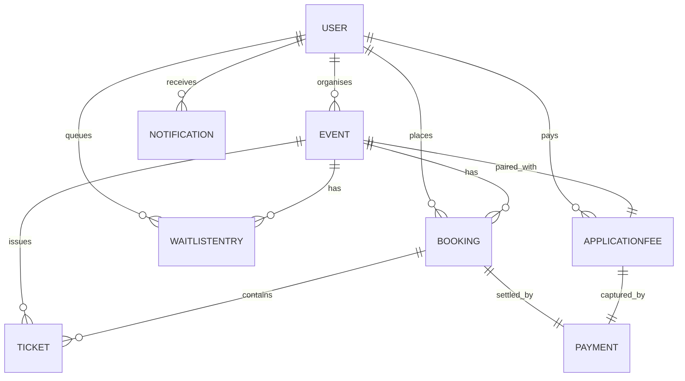

## 7.3 Data dictionary

### 7.3.1 User

Table 5. User fields.

| Field | Type | Constraint |
|---|---|---|
| id | UUID | Primary key |
| email | string | Unique, not null |
| passwordHash | string | Not null |
| role | enum | customer, organiser, administrator |
| name | string | Not null |
| phone | string | Nullable; retained for future short message service |
| createdAt | timestamp | Auto |
| updatedAt | timestamp | Auto |

### 7.3.2 Event

Table 6. Event fields.

| Field | Type | Constraint |
|---|---|---|
| id | UUID | Primary key |
| organizerId | UUID | Foreign key to User; not null |
| title | string | Not null |
| description | text | Not null |
| category | string | Not null |
| location | string | Not null |
| startsAt | timestamp | Not null |
| endsAt | timestamp | Not null, after startsAt |
| capacity | integer | Not null, positive |
| remaining | integer | Not null, zero or positive, never above capacity |
| ticketPrice | decimal | Not null, zero or positive |
| imageUrl | string | Nullable |
| status | enum | pending, active, cancelled, completed |
| refundDeadline | timestamp | Not null, before startsAt |
| registrationOpen | boolean | Default true |
| createdAt | timestamp | Auto |
| updatedAt | timestamp | Auto |

### 7.3.3 Booking

Table 7. Booking fields.

| Field | Type | Constraint |
|---|---|---|
| id | UUID | Primary key |
| userId | UUID | Foreign key to User; not null |
| eventId | UUID | Foreign key to Event; not null |
| quantity | integer | Not null, positive |
| totalAmount | decimal | Not null, zero or positive |
| status | enum | pending, confirmed, cancelled, refunded |
| placedAt | timestamp | Not null |
| createdAt | timestamp | Auto |
| updatedAt | timestamp | Auto |

### 7.3.4 Ticket

Table 8. Ticket fields.

| Field | Type | Constraint |
|---|---|---|
| id | UUID | Primary key |
| eventId | UUID | Foreign key to Event; not null |
| bookingId | UUID | Foreign key to Booking; not null |
| userId | UUID | Foreign key to User; not null |
| qrCode | text | Not null, unique |
| status | enum | valid, used, refunded |
| issuedAt | timestamp | Not null |
| createdAt | timestamp | Auto |
| updatedAt | timestamp | Auto |

### 7.3.5 Payment

Table 9. Payment fields.

| Field | Type | Constraint |
|---|---|---|
| id | UUID | Primary key |
| bookingId | UUID | Foreign key to Booking; nullable |
| applicationFeeId | UUID | Foreign key to ApplicationFee; nullable |
| amount | decimal | Not null, positive |
| gateway | string | Constant value, stripe |
| gatewayPaymentIntentId | string | Not null |
| status | enum | pending, succeeded, failed, refunded |
| paidAt | timestamp | Nullable |
| refundedAt | timestamp | Nullable |
| createdAt | timestamp | Auto |
| updatedAt | timestamp | Auto |

A payment row links to either a booking or an application fee; never both at once.

### 7.3.6 WaitlistEntry

Table 10. WaitlistEntry fields.

| Field | Type | Constraint |
|---|---|---|
| id | UUID | Primary key |
| userId | UUID | Foreign key to User; not null |
| eventId | UUID | Foreign key to Event; not null |
| position | integer | Not null, positive, unique per event |
| status | enum | queued, held, converted, expired |
| holdExpiresAt | timestamp | Nullable; set when status becomes held |
| notifiedAt | timestamp | Nullable |
| createdAt | timestamp | Auto |
| updatedAt | timestamp | Auto |

### 7.3.7 Notification

Table 11. Notification fields.

| Field | Type | Constraint |
|---|---|---|
| id | UUID | Primary key |
| userId | UUID | Foreign key to User; not null |
| type | enum | booking_receipt, waitlist_alert, event_update, refund_confirmation |
| channel | enum | email, sms, in_app; only email is implemented in this release |
| payload | JSONB | Not null |
| status | enum | queued, sent, failed |
| sentAt | timestamp | Nullable |
| createdAt | timestamp | Auto |
| updatedAt | timestamp | Auto |

### 7.3.8 ApplicationFee

Table 12. ApplicationFee fields.

| Field | Type | Constraint |
|---|---|---|
| id | UUID | Primary key |
| organizerId | UUID | Foreign key to User; not null |
| eventId | UUID | Foreign key to Event; not null, unique |
| amount | decimal | Not null, positive |
| status | enum | held, consumed, refunded |
| heldAt | timestamp | Not null |
| resolvedAt | timestamp | Nullable, set when status leaves held |
| createdAt | timestamp | Auto |
| updatedAt | timestamp | Auto |

## 7.4 Integrity rules

Foreign keys cascade on delete only where the parent record is intentionally a container for the child; for example, the deletion of a booking cascades to its tickets. A user is never hard deleted; user deletion is implemented as deactivation in a future release.

Unique constraints. The email column on the user table is unique. The QR code column on the ticket table is unique. The position column on the waitlist entry table is unique per event. The event identifier on the application fee table is unique; each event has at most one application fee.

Check constraints. The remaining column on the event table is constrained to zero or a positive value and to not exceed the capacity column. The quantity column on the booking table is constrained to a positive value.

Enumeration domains are constant; new values may be added but existing values are not renamed.

# Chapter 8. State and behaviour models

## 8.1 Event lifecycle

Figure 5. Event lifecycle. An event moves from pending through active and on to completed, or sideways to cancelled.

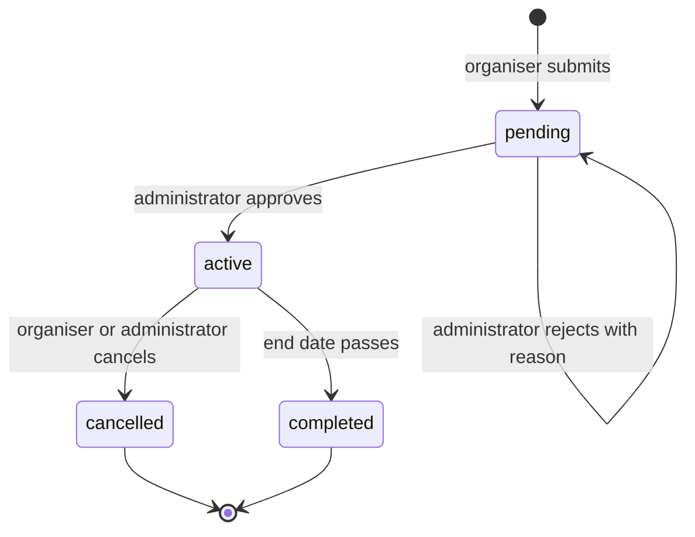

## 8.2 Booking status

Figure 6. Booking status. A booking is created in the pending state and is confirmed once Stripe captures the payment; cancellation may follow.

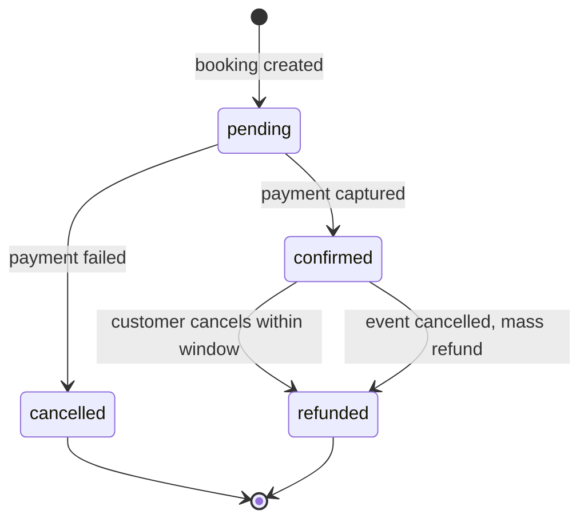

## 8.3 Waitlist entry status

Figure 7. Waitlist entry status. An entry waits in the queue, is offered a held window when a seat opens, and either converts into a booking or expires.

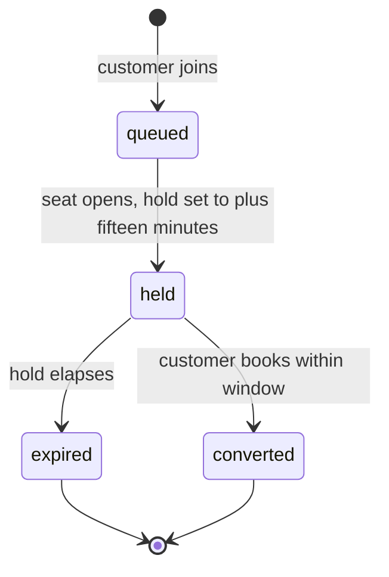

## 8.4 Application fee status

Figure 8. Application fee status. The fee is held at submission and resolves on the administrator decision.

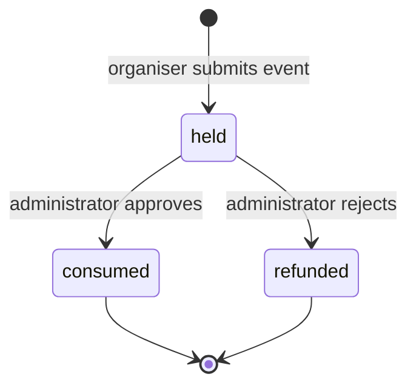

## 8.5 Booking sequence

Figure 9. Booking sequence. The figure shows the path of a successful booking from the customer click to the email queue.

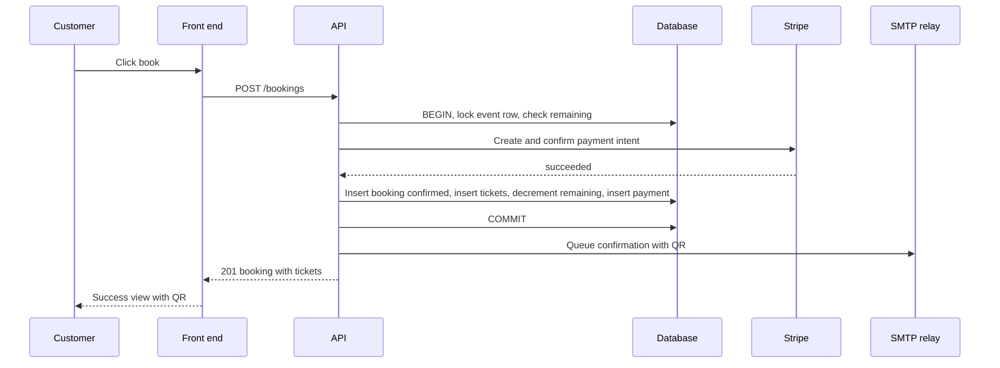

## 8.6 Waitlist promotion sequence

Figure 10. Waitlist promotion sequence. The figure shows the promotion path after a booking is cancelled.

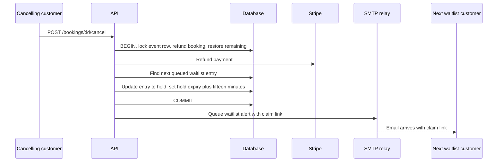

## 8.7 Event submission and approval sequence

Figure 11. Event submission and approval sequence. The figure shows the path from submission, through the held fee, to the administrator decision.

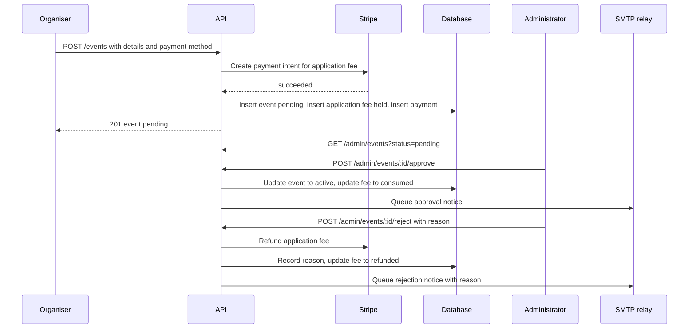

## 8.8 Mass refund sequence

Figure 12. Mass refund sequence. The figure shows the path when an organiser or administrator cancels an active event.

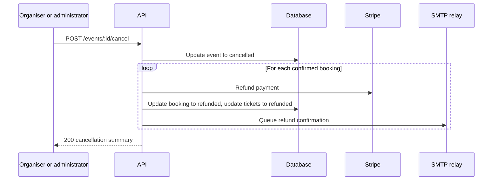

# Chapter 9. Non functional requirements

Each non functional requirement is paired with a measurable acceptance criterion.

## 9.1 Performance

NFR-PERF-001 Booking endpoint latency.
Statement, the booking endpoint should respond within five hundred milliseconds at the ninety fifth percentile under fifty concurrent customers. Source, design baseline. Priority, Must. Acceptance criterion, a load test of fifty concurrent customers booking against ten events meets the latency target across a ten minute run.

NFR-PERF-002 Catalogue endpoint latency.
Statement, the catalogue listing endpoint should respond within three hundred milliseconds at the ninety fifth percentile under one hundred concurrent visitors. Source, design baseline. Priority, Should. Acceptance criterion, the same load profile against the catalogue meets the target.

NFR-PERF-003 QR code generation.
Statement, the system should generate the QR code for a ticket within two hundred milliseconds. Rationale, the QR is computed during the booking commit. Source, design baseline. Priority, Should. Acceptance criterion, generation time at the ninety fifth percentile is under two hundred milliseconds.

NFR-PERF-004 Notification dispatch.
Statement, the system should queue a notification within ten seconds of the triggering event. Rationale, customers expect prompt confirmation. Source, project flow analysis. Priority, Must. Acceptance criterion, the time between the state transition and the notification row reaching the sent state averages under ten seconds.

## 9.2 Security

NFR-SEC-001 Password hashing strength.
Statement, the system shall hash passwords with bcrypt at a cost of ten or higher. Source, security baseline. Priority, Must. Acceptance criterion, every user row carries a bcrypt prefix with the configured cost.

NFR-SEC-002 Token lifetime.
Statement, the system shall issue JSON web tokens with a lifetime of no more than twenty four hours and shall reject expired tokens. Source, security baseline. Priority, Must. Acceptance criterion, a token presented past its expiry returns four hundred and one.

NFR-SEC-003 Transport security.
Statement, the system shall accept inbound requests only over transport layer security in production. Source, security baseline. Priority, Must. Acceptance criterion, plain hypertext transfer protocol requests are redirected to the secure scheme at the edge.

NFR-SEC-004 Common web vulnerabilities.
Statement, the system shall protect against the Open Web Application Security Project top ten classes of vulnerability; cross site scripting is mitigated by output escaping in React, structured query language injection is mitigated by parameterised queries in Sequelize, cross site request forgery is mitigated by the bearer token model. Source, security baseline. Priority, Must. Acceptance criterion, a security review confirms each mitigation is in place.

NFR-SEC-005 Personal data at rest.
Statement, the system shall avoid storing personal data beyond what is necessary; the name and email address are stored, the phone number is optional, and no card data is stored. Source, security baseline. Priority, Must. Acceptance criterion, the data dictionary contains no card fields.

NFR-SEC-006 No card data on the server.
Statement, the system shall keep card data outside the server boundary; card details flow from the browser to Stripe and only the resulting payment intent identifier returns. Source, security baseline. Priority, Must. Acceptance criterion, log inspection shows no card numbers.

NFR-SEC-007 Authentication rate limiting.
Statement, the system shall rate limit the login endpoint to a small number of attempts per minute per address. Source, security baseline. Priority, Must. Acceptance criterion, after the limit is reached further attempts return four hundred and twenty nine with a retry header.

## 9.3 Reliability and data consistency

NFR-REL-001 Concurrent booking safety.
Statement, the system shall ensure that the remaining count of an event is decremented atomically under concurrent bookings, with row level locking. Source, agile project proposal. Priority, Must. Acceptance criterion, under a load of one hundred concurrent bookings for a single remaining seat, exactly one succeeds.

NFR-REL-002 No double refund.
Statement, the system shall not refund a booking or an application fee twice; the refund operation is idempotent on the payment row. Source, design baseline. Priority, Must. Acceptance criterion, two refund attempts on the same payment row result in a single refund record.

NFR-REL-003 Idempotent webhook handling.
Statement, the system shall handle Stripe webhooks idempotently by Stripe event identifier. Source, security and reliability baseline. Priority, Must. Acceptance criterion, a duplicate webhook delivery does not produce a second state transition.

NFR-REL-004 Remaining count invariant.
Statement, the remaining count of an event shall never be negative and shall never exceed the capacity. Source, agile project proposal. Priority, Must. Acceptance criterion, the database check constraint rejects out of range values.

## 9.4 Maintainability

NFR-MAINT-001 Design pattern adherence.
Statement, the codebase shall follow the design pattern map; payment, notification, policies, and event state are implemented as strategy or state objects. Source, design constraints. Priority, Must. Acceptance criterion, a static review shows no if or switch branching on role, gateway, channel, or event status outside the corresponding strategy folder.

NFR-MAINT-002 Repository as the only Sequelize touch point.
Statement, the codebase shall keep Sequelize access inside the repository layer; no service or handler imports a model directly. Source, design constraints. Priority, Must. Acceptance criterion, a static review confirms the constraint.

NFR-MAINT-003 Single source of truth per concern.
Statement, configuration shall live in the configuration folder; entity shape shall live in Sequelize models; route lists shall live in the routes folder; user interface state shall live in React contexts. Source, design constraints. Priority, Must. Acceptance criterion, a code review checklist enforces the rule.

## 9.5 Usability

NFR-USAB-001 Responsive layout.
Statement, the system shall render usable layouts on viewport widths from three hundred and twenty pixels upward. Source, wireframe analysis. Priority, Must. Acceptance criterion, the design at narrow widths shows a stacked layout without horizontal scroll.

NFR-USAB-002 Keyboard navigation.
Statement, every interactive control shall be reachable and operable by keyboard alone. Source, accessibility baseline. Priority, Should. Acceptance criterion, the tab order matches the visual order and every control has a visible focus style.

NFR-USAB-003 Actionable error messages.
Statement, error messages shall name the field and the cause without leaking internal detail. Source, design baseline. Priority, Must. Acceptance criterion, a review of error states confirms the rule.

## 9.6 Portability

NFR-PORT-001 Local containerised stack.
Statement, the system shall run the full stack from a single Docker Compose file on a developer workstation. Source, design constraints. Priority, Must. Acceptance criterion, a fresh checkout starts every service through the compose file.

## 9.7 Auditability

NFR-AUD-001 Immutable payment trail.
Statement, the system shall keep every payment and refund event as an immutable database row with timestamps. Source, project flow analysis. Priority, Must. Acceptance criterion, payment rows are insert only; updates only set the paid at or refunded at timestamp and the status.

NFR-AUD-002 State transition logging.
Statement, the system shall record every state transition for events, bookings, and waitlist entries with a timestamp and the actor identifier. Source, project flow analysis. Priority, Should. Acceptance criterion, an audit query lists transitions for a given identifier in time order.

# Chapter 10. Agile delivery plan

The delivery plan is broken into five phases. Each phase has a goal, a deliverable, and an exit criterion.

Table 13. Phase summary.

| Phase | Goal | Deliverable | Exit criterion |
|---|---|---|---|
| One, core setup | Authentication, event submission, administrator approval | Working pending to active flow with held and consumed application fee | An administrator can approve a submitted event end to end |
| Two, booking with concurrency safety | Catalogue, details, booking, atomic seat decrement | Booking endpoint with row level locking and concurrent safety tests | Concurrent booking test passes |
| Three, waitlist and notifications | Waitlist join, auto promote with hold, email channel | Waitlist flow with fifteen minute hold and confirmation emails | An expired hold demotes and the next entry is promoted |
| Four, payments | Stripe integration for booking and application fee, refund flows | Booking refund and mass refund work end to end | A cancellation refunds every confirmed booking |
| Five, hardening | Performance, security, accessibility, polish | Production readiness checklist signed off | Every must priority requirement passes its acceptance criterion |

Table 14. Functional requirement to phase mapping.

| Phase | Functional requirement identifiers |
|---|---|
| One | FR-AUTH-001 to FR-AUTH-005, FR-EVT-001, FR-EVT-002, FR-EVT-004, FR-MOD-001, FR-MOD-002, FR-MOD-003, FR-PAY-001, FR-PAY-002, FR-PAY-003 |
| Two | FR-DISC-001 to FR-DISC-006, FR-BOOK-001 to FR-BOOK-007, FR-BOOK-010, FR-EVT-007, FR-EVT-008 |
| Three | FR-WAIT-001 to FR-WAIT-006, FR-NOTIF-001 to FR-NOTIF-005, FR-EVT-003 |
| Four | FR-BOOK-008, FR-BOOK-009, FR-PAY-004 to FR-PAY-010, FR-EVT-006, FR-MOD-004, FR-MOD-005 |
| Five | All NFR identifiers, FR-EVT-005 |

The current state of delivery is recorded at the time of writing. Phase one is complete on the back end for authentication and on the front end as a mock driven build of every screen. Phase two booking and concurrency work is in progress on the back end. Phase three, four, and five remain.

# Chapter 11. Traceability matrices

Three matrices are recorded. Together they let a reviewer confirm that every functional requirement has a source in a use case, a surface in the user interface, and a slot in the delivery plan.

## 11.1 Use case to functional requirement

Table 15. Use case to functional requirement matrix.

| Use case | Realising functional requirements |
|---|---|
| UC-CUST-001 Register | FR-AUTH-001, FR-AUTH-003 |
| UC-CUST-002 Log in | FR-AUTH-002, FR-AUTH-003 |
| UC-CUST-003 Browse top events | FR-DISC-001 |
| UC-CUST-004 Browse all events | FR-DISC-002 |
| UC-CUST-005 Filter events | FR-DISC-003 |
| UC-CUST-006 View event details | FR-DISC-004, FR-DISC-005 |
| UC-CUST-007 Book ticket | FR-BOOK-001 to FR-BOOK-007 |
| UC-CUST-008 Join waitlist | FR-WAIT-001 |
| UC-CUST-009 Cancel booking | FR-BOOK-008, FR-PAY-006, FR-WAIT-002 |
| UC-CUST-010 View own tickets | FR-BOOK-009 |
| UC-ORG-001 Register as organiser | FR-AUTH-001, FR-AUTH-003 |
| UC-ORG-002 Submit event | FR-EVT-001, BR-FEE-001 |
| UC-ORG-003 Pay application fee | FR-PAY-001 |
| UC-ORG-004 Edit pending event | FR-EVT-002 |
| UC-ORG-005 Toggle registration | FR-EVT-003 |
| UC-ORG-006 Cancel event | FR-EVT-006, FR-PAY-007, FR-NOTIF-003 |
| UC-ORG-007 View own events | FR-EVT-004 |
| UC-ORG-008 View analytics | FR-EVT-005 |
| UC-ADM-001 Log in | FR-AUTH-002 |
| UC-ADM-002 View approval queue | FR-MOD-001 |
| UC-ADM-003 Approve event | FR-MOD-002, FR-PAY-002, FR-NOTIF-005 |
| UC-ADM-004 Reject event with reason | FR-MOD-003, FR-PAY-003, FR-NOTIF-005 |
| UC-ADM-005 View all events | FR-MOD-004 |
| UC-ADM-006 View users | FR-MOD-005 |

## 11.2 Functional requirement to screen

Table 16. Functional requirement to screen matrix.

| Functional requirement | Screen |
|---|---|
| FR-AUTH-001, FR-AUTH-002 | Login and register |
| FR-AUTH-003 to FR-AUTH-005 | Cross cutting; not tied to a single screen |
| FR-EVT-001, FR-PAY-001 | Event creation |
| FR-EVT-002, FR-EVT-003, FR-EVT-004, FR-EVT-005, FR-EVT-006 | Organiser dashboard |
| FR-EVT-007, FR-EVT-008 | Cross cutting; affects every event read |
| FR-MOD-001 to FR-MOD-003 | Administrator approval |
| FR-MOD-004, FR-MOD-005 | Administrator dashboard |
| FR-DISC-001 | Home |
| FR-DISC-002, FR-DISC-003 | All events |
| FR-DISC-004, FR-DISC-005 | Event details |
| FR-DISC-006 | Cross cutting; affects every public read |
| FR-BOOK-001 to FR-BOOK-007 | Ticket booking |
| FR-BOOK-008, FR-BOOK-009 | Main dashboard |
| FR-BOOK-010 | Cross cutting; database invariant |
| FR-WAIT-001 | Ticket booking |
| FR-WAIT-002, FR-WAIT-004, FR-WAIT-006 | Cross cutting; background work |
| FR-WAIT-003 | Ticket booking |
| FR-WAIT-005 | Main dashboard |
| FR-PAY-002, FR-PAY-003 | Administrator approval |
| FR-PAY-004 | Ticket booking |
| FR-PAY-005, FR-PAY-009, FR-PAY-010 | Cross cutting |
| FR-PAY-006, FR-PAY-008 | Main dashboard |
| FR-PAY-007 | Organiser dashboard |
| FR-NOTIF-001 to FR-NOTIF-005 | Cross cutting; the email channel |

## 11.3 Functional requirement to phase

Table 17. Functional requirement to phase matrix.

| Functional requirement | Phase |
|---|---|
| FR-AUTH-001 to FR-AUTH-005 | One |
| FR-EVT-001, FR-EVT-002, FR-EVT-004, FR-EVT-007, FR-EVT-008 | One |
| FR-EVT-003 | Three |
| FR-EVT-005 | Five |
| FR-EVT-006 | Four |
| FR-MOD-001 to FR-MOD-003 | One |
| FR-MOD-004, FR-MOD-005 | Four |
| FR-DISC-001 to FR-DISC-006 | Two |
| FR-BOOK-001 to FR-BOOK-007, FR-BOOK-010 | Two |
| FR-BOOK-008, FR-BOOK-009 | Four |
| FR-WAIT-001 to FR-WAIT-006 | Three |
| FR-PAY-001 to FR-PAY-003 | One |
| FR-PAY-004 to FR-PAY-010 | Four |
| FR-NOTIF-001 to FR-NOTIF-005 | Three |
| All NFR identifiers | Five |

# Chapter 12. Assumptions, constraints, and open questions

## 12.1 Assumptions

Stripe is reachable from the server. The outbound mail relay is reachable and accepts the message envelope. Customers can render QR codes embedded in or attached to email. The administrator population is small and can be provisioned out of band. Organiser self serve registration is acceptable in the first release; abuse is observed and policy is revisited if abuse emerges.

## 12.2 Constraints

The technology stack is fixed; React eighteen with Vite on the client, Fastify on Node.js twenty or later on the server, PostgreSQL fifteen or later through Sequelize for storage, Stripe for payments, simple mail transfer protocol for delivery. The design discipline is fixed; strategies, state objects, repositories, and factory functions are used in place of conditional ladders, inheritance, and direct database access from services. No class declarations are used on the server.

## 12.3 Resolved ambiguities

Concurrent booking safety is resolved by row level locking on the event row inside a database transaction. Application fee handling is resolved by escrow style capture at submission with consumption on approval or refund on rejection. The refund window is per event and is set by the organiser. Waitlist promotion runs in a fifteen minute held state. Notification channels in this release are limited to email; the strategy boundary allows further channels later without service changes.

## 12.4 Open questions deferred to later sprints

The application fee amount is a flat value in the first release; whether it should become category based or a percentage of projected revenue is deferred. The search experience is filter based in the first release; full text search is deferred. The related events algorithm is a simple rule; a richer recommendation engine is deferred. The administrator approval rubric is left to administrator discretion; a formal rubric is deferred. The metric list for organiser analytics is limited to ticket sales and revenue in the first release; richer metrics are deferred. Password reset and profile management are deferred. Notification preferences and opt out are revisited when channels beyond email arrive.

# Chapter 13. Glossary

Active. The status of an event that has been approved by the administrator and is open for bookings.

Administrator. The privileged user role that approves or rejects event submissions and moderates the platform.

Application fee. The refundable fee paid by the organiser at the moment of event submission, held in escrow until the administrator decides.

Booking. A customer purchase of one or more tickets for a single event.

Cancelled. The status of an event that has been cancelled by its organiser or by the administrator.

Capacity. The total number of tickets that an event accepts.

Catalogue. The paginated list of active events presented to customers.

Completed. The status of an event whose end date and time has passed.

Confirmed. The status of a booking whose payment has been captured.

Customer. The end user role that browses events and books tickets.

Escrow. A holding state for funds; in this document, the Stripe authorisation that holds the application fee.

Event. A scheduled occasion for which tickets are sold.

Expired. The status of a waitlist entry whose held window has elapsed without a booking.

Front end. The single page application served to the user's browser.

Functional requirement. A statement of what the system shall do, identified by a code beginning with FR.

Held. The status of a waitlist entry that has been offered a seat for a limited time. Also the status of an application fee captured but not yet resolved.

JSON web token. A signed token used to carry session identity from the client to the server on each request.

Mass refund. The automatic refund of every confirmed booking for an event when the event is cancelled.

MoSCoW. A priority scheme; Must, Should, Could, Won't.

Non functional requirement. A statement of how the system shall behave, identified by a code beginning with NFR.

Notification. A queued or sent message to a user.

Organiser. The user role that creates and manages events.

Payment intent. The Stripe object that represents a payment in progress.

Pending. The status of an event that has been submitted by an organiser but not yet decided by the administrator. Also the status of a booking whose payment has not yet been captured.

QR code. Quick Response code; a two dimensional barcode used to validate a ticket.

Refund deadline. The cut off time, set per event by the organiser, after which a customer can no longer cancel for a refund.

Refunded. The status of a booking or an application fee that has been refunded through Stripe.

Remaining. The current count of unsold tickets for an event.

Repository. The data access layer that holds every Sequelize call.

Sequelize. The object relational mapper used to access the PostgreSQL database.

Strategy. A design pattern in which a family of behaviours is selected from configuration; used here for payment, notification, and policy concerns.

Super administrator. See Administrator.

Ticket. A single admission, holding the QR code value and a status.

Token. See JSON web token.

User. The base account record from which the customer, organiser, and administrator roles are derived.

Waitlist. The ordered queue of customers waiting for a ticket on a full event.

Waitlist entry. A position on the waitlist for a single customer and a single event.

# Appendix A. Source resource summary

The agile project proposal sets the scope of the platform end to end. It identifies the three user roles, the seven entity families used in the resource, the four feature pillars, and the five non functional concerns. The proposal also names the application fee as refundable, sets out the waitlist as a first class feature, and points to mass refund language around payments.

The project flow analysis records the four main user journeys; customer discovery, customer booking, organiser event creation, and management and administration. It introduces the per event refund deadline, the QR coded ticket flow by email, and the requirement to handle concurrent bookings safely.

The wireframe collection enumerates ten screens; login and register, home, all events, event details, event creation, ticket booking, administrator approval, organiser dashboard, administrator dashboard, and main dashboard. Each screen is described in terms of the components it carries and the user role that may view it.

The work breakdown structure groups the build into eight modules; event creation, ticket booking, payment system, event browsing, authentication system, main dashboard, organiser dashboard, and administrator dashboard. The grouping maps to the back end service boundaries used in the architecture chapter.

# Appendix B. Architecture decisions

ADR one, application fee flow.
Decision, the organiser pays a flat application fee at submission; the fee is held by Stripe; on approval the fee is consumed by the platform; on rejection the fee is refunded. The application fee record carries a status field with the values held, consumed, and refunded.

ADR two, payment gateway.
Decision, Stripe is the only gateway at launch. A payment strategy interface is defined; a Stripe strategy is the only implementation in this release. Future gateways are added as new strategy files without changes to services.

ADR three, ticket refund policy.
Decision, each event carries a refund deadline set by the organiser. A customer cancellation is allowed if the current time is before the deadline. If the event itself is cancelled, every confirmed booking is refunded automatically.

ADR four, waitlist promotion.
Decision, the waitlist auto promotes the next queued entry on every cancellation. The promoted entry transitions to a held state with a hold expiry of fifteen minutes. If the customer books within the hold the entry transitions to converted; otherwise it transitions to expired and the next queued entry is promoted. A background sweep handles expiry without user traffic.

ADR five, notification channels.
Decision, email is the only notification channel in this release. A notification strategy boundary is defined per channel; short message service and in application channels exist as interface stubs only. Adding a channel is a new strategy file without service changes.

# Appendix C. Sample data payloads

Sample register request, sent to POST /auth/register.

```
{
  "name": "Aiman Tariq",
  "email": "aiman@example.com",
  "password": "S3cure!Pass",
  "role": "customer"
}
```

Sample register response.

```
{
  "user": {
    "id": "f2c6f1e4-8d36-4ec2-9e29-7a3a8dc6cd11",
    "name": "Aiman Tariq",
    "email": "aiman@example.com",
    "role": "customer"
  },
  "token": "eyJhbGciOiJIUzI1NiIsInR5cCI6IkpXVCJ9..."
}
```

Sample login request, sent to POST /auth/login.

```
{
  "email": "aiman@example.com",
  "password": "S3cure!Pass"
}
```

Sample event creation request, sent to POST /events.

```
{
  "title": "Spring Music Festival",
  "description": "Two day open air festival with local artists.",
  "category": "music",
  "location": "Lahore, Pakistan",
  "startsAt": "2026-06-12T17:00:00Z",
  "endsAt": "2026-06-13T23:00:00Z",
  "capacity": 500,
  "ticketPrice": 25.00,
  "refundDeadline": "2026-06-10T23:59:00Z",
  "imageUrl": "https://cdn.example.com/spring-music.jpg",
  "paymentMethodId": "pm_1NfRl2..."
}
```

Sample booking request, sent to POST /bookings.

```
{
  "eventId": "9b0fa1d0-7df0-4c2a-9b18-2e9f5b3a3210",
  "quantity": 2,
  "paymentMethodId": "pm_1NfRl2..."
}
```

Sample booking response.

```
{
  "booking": {
    "id": "7b1f6d2a-3b41-4c0a-8a4c-2f9b5a6c8e10",
    "status": "confirmed",
    "quantity": 2,
    "totalAmount": 50.00
  },
  "tickets": [
    { "id": "t1", "qrCode": "QR-...A", "status": "valid" },
    { "id": "t2", "qrCode": "QR-...B", "status": "valid" }
  ]
}
```

Sample Stripe webhook envelope, posted to POST /webhooks/stripe.

```
{
  "id": "evt_1NfRl2...",
  "object": "event",
  "type": "payment_intent.succeeded",
  "data": {
    "object": {
      "id": "pi_1NfRl2...",
      "status": "succeeded",
      "amount": 5000,
      "currency": "usd"
    }
  }
}
```

Sample error envelope, returned for any failed request, following RFC 7807.

```
{
  "type": "https://example.com/errors/registration-closed",
  "title": "Registration is closed",
  "status": 409,
  "detail": "The organiser has paused new bookings for this event."
}
```

# Appendix D. Mermaid diagram sources

The complete source for every diagram is gathered here so the diagrams can be rendered in a single pass with an external Mermaid editor.

Figure 1 source.


Figure 2 source.


Figure 3a source.


Figure 3b source.


Figure 3c source.


Figure 4 source.


Figure 5 source.

```mermaid
stateDiagram-v2
  [*] --> pending : organiser submits
  pending --> active : administrator approves
  pending --> pending : administrator rejects with reason
  active --> cancelled : organiser or administrator cancels
  active --> completed : end date passes
  cancelled --> [*]
  completed --> [*]
```

Figure 6 source.

```mermaid
stateDiagram-v2
  [*] --> pending : booking created
  pending --> confirmed : payment captured
  pending --> cancelled : payment failed
  confirmed --> refunded : customer cancels within window
  confirmed --> refunded : event cancelled, mass refund
  cancelled --> [*]
  refunded --> [*]
```

Figure 7 source.

```mermaid
stateDiagram-v2
  [*] --> queued : customer joins
  queued --> held : seat opens, hold set to plus fifteen minutes
  held --> converted : customer books within window
  held --> expired : hold elapses
  expired --> [*]
  converted --> [*]
```

Figure 8 source.

```mermaid
stateDiagram-v2
  [*] --> held : organiser submits event
  held --> consumed : administrator approves
  held --> refunded : administrator rejects
  consumed --> [*]
  refunded --> [*]
```

Figure 9 source.

```mermaid
sequenceDiagram
  participant C as Customer
  participant FE as Front end
  participant API as API
  participant DB as Database
  participant Stripe as Stripe
  participant Mail as SMTP relay
  C->>FE: Click book
  FE->>API: POST /bookings
  API->>DB: BEGIN, lock event row, check remaining
  API->>Stripe: Create and confirm payment intent
  Stripe-->>API: succeeded
  API->>DB: Insert booking confirmed, insert tickets, decrement remaining, insert payment
  API->>DB: COMMIT
  API->>Mail: Queue confirmation with QR
  API-->>FE: 201 booking with tickets
  FE-->>C: Success view with QR
```

Figure 10 source.

```mermaid
sequenceDiagram
  participant C as Cancelling customer
  participant API as API
  participant DB as Database
  participant Stripe as Stripe
  participant Mail as SMTP relay
  participant W as Next waitlist customer
  C->>API: POST /bookings/:id/cancel
  API->>DB: BEGIN, lock event row, refund booking, restore remaining
  API->>Stripe: Refund payment
  API->>DB: Find next queued waitlist entry
  API->>DB: Update entry to held, set hold expiry plus fifteen minutes
  API->>DB: COMMIT
  API->>Mail: Queue waitlist alert with claim link
  Mail-->>W: Email arrives with claim link
```

Figure 11 source.

```mermaid
sequenceDiagram
  participant O as Organiser
  participant API as API
  participant Stripe as Stripe
  participant DB as Database
  participant A as Administrator
  participant Mail as SMTP relay
  O->>API: POST /events with details and payment method
  API->>Stripe: Create payment intent for application fee
  Stripe-->>API: succeeded
  API->>DB: Insert event pending, insert application fee held, insert payment
  API-->>O: 201 event pending
  A->>API: GET /admin/events?status=pending
  A->>API: POST /admin/events/:id/approve
  API->>DB: Update event to active, update fee to consumed
  API->>Mail: Queue approval notice
  A->>API: POST /admin/events/:id/reject with reason
  API->>Stripe: Refund application fee
  API->>DB: Record reason, update fee to refunded
  API->>Mail: Queue rejection notice with reason
```

Figure 12 source.

```mermaid
sequenceDiagram
  participant Caller as Organiser or administrator
  participant API as API
  participant DB as Database
  participant Stripe as Stripe
  participant Mail as SMTP relay
  Caller->>API: POST /events/:id/cancel
  API->>DB: Update event to cancelled
  loop For each confirmed booking
    API->>Stripe: Refund payment
    API->>DB: Update booking to refunded, update tickets to refunded
    API->>Mail: Queue refund confirmation
  end
  API-->>Caller: 200 cancellation summary
```

End of document.

